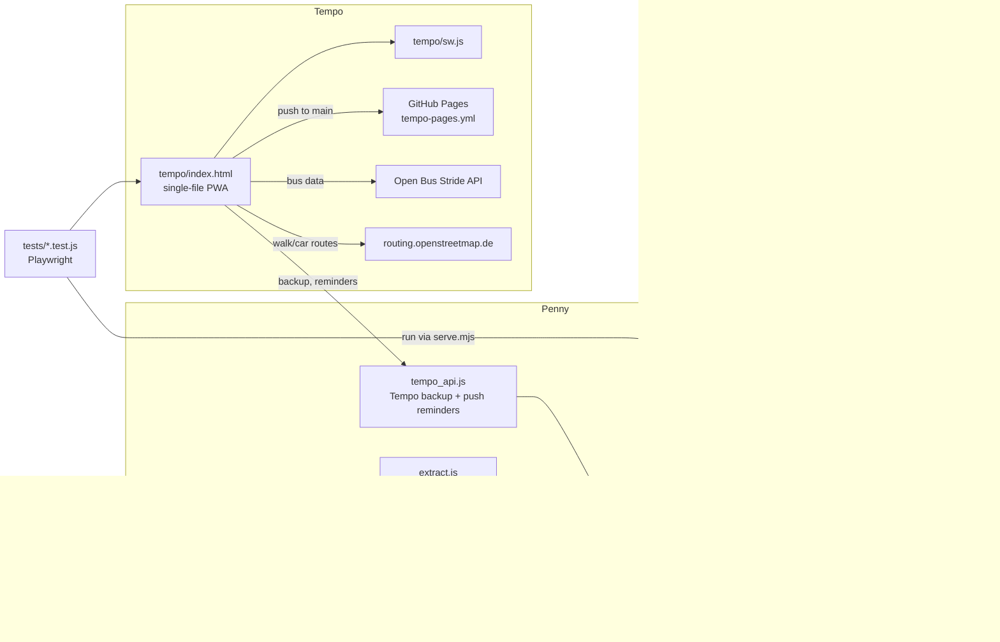
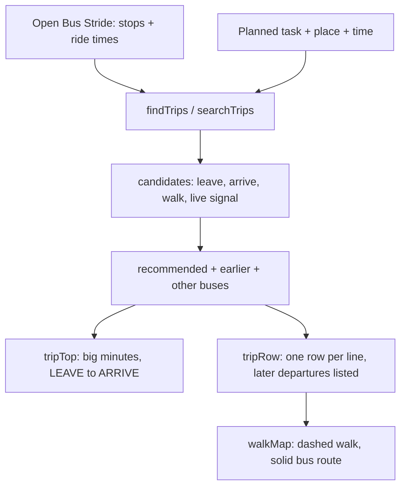

# Project map

```mermaid
flowchart LR
  subgraph Penny
    W[want3.html<br/>UI, inline JS/CSS] --> B
    S[sync_api.js<br/>/api/* endpoints] --> B
    E[extract.js<br/>product-link reader] --> B
    T[tempo_api.js<br/>Tempo backup + push reminders] --> B
    B[build_worker.py] --> WJ[worker.js<br/>generated]
    WJ -->|push to main| CF[(Cloudflare Worker + KV)]
  end
  subgraph Tempo
    TI[tempo/index.html<br/>single-file PWA] --> SW[tempo/sw.js]
    TI -->|push to main| GP[GitHub Pages<br/>tempo-pages.yml]
    TI -->|bus data| OB[Open Bus Stride API]
    TI -->|walk/car routes| OSM[routing.openstreetmap.de]
    TI -->|backup, reminders| T
  end
  W <-->|sync, backup| S
  TS[tests/*.test.js<br/>Playwright] -->|run via serve.mjs| WJ
  TS --> TI
```

```mermaid
flowchart TD
  A[Open Bus Stride: stops + ride times] --> F[findTrips / searchTrips]
  P[Planned task + place + time] --> F
  F --> C[candidates: leave, arrive, walk, live signal]
  C --> R[recommended + earlier + other buses]
  R --> TT[tripTop: big minutes, LEAVE to ARRIVE]
  R --> TR[tripRow: one row per line, later departures listed]
  TR --> M[walkMap: dashed walk, solid bus route]
```

Sizes: `want3.html` ~1.0k lines, `tempo/index.html` ~2.0k, `sync_api.js` ~240, `extract.js` ~190, `tempo_api.js` ~85.
